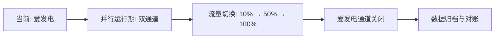

# APEXWORK 境内专属隔离收银台 · 施工方案

> **任务编号**：TASK-202  
> **执行部门**：施工工程部  
> **优先级**：P0（阻断性替换）  
> **状态**：待验收

---

## 一、背景与目标

### 1.1 背景
- 现行支付通道依赖第三方平台（爱发电），存在**接口不稳定、结算周期长、境内合规风险**等问题。
- 用户支付体验割裂，无法实现**订单自动对账**与**会员权益即时发放**。

### 1.2 目标
- 构建**境内专属隔离收银台**，完全替换爱发电通道。
- 实现**支付-回调-权益发放**全链路自动化。
- 确保**资金流、信息流、凭证流**三流隔离且可审计。

---

## 二、系统架构

```
┌─────────────────────────────────────────────────────────┐
│                    用户端 (Web/H5)                        │
│              [商品展示] → [收银台弹窗]                     │
└──────────────────────────┬──────────────────────────────┘
                           │ HTTPS + 签名
┌──────────────────────────▼──────────────────────────────┐
│              APEXWORK 收银台网关 (隔离区)                  │
│  ┌────────────┐  ┌────────────┐  ┌──────────────────┐  │
│  │ 订单服务    │  │ 支付路由    │  │ 回调验签服务      │  │
│  │ (幂等创建)  │  │ (渠道隔离)  │  │ (防重放/防篡改)   │  │
│  └────────────┘  └────────────┘  └──────────────────┘  │
└──────────┬──────────────────────────────┬───────────────┘
           │                              │
┌──────────▼──────────┐        ┌──────────▼───────────────┐
│  境内支付渠道 (隔离)  │        │  权益发放服务 (异步)       │
│  ├─ 微信支付(直连)   │        │  ├─ 会员标签激活           │
│  ├─ 支付宝(直连)     │        │  ├─ 数字凭证签发           │
│  └─ 银联云闪付(备选) │        │  └─ 发票/收据自动推送      │
└─────────────────────┘        └──────────────────────────┘
```

---

## 三、核心模块实现

### 3.1 订单服务（幂等创建）

```python
# 伪代码：订单创建接口
def create_order(user_id, product_id, channel="wechat"):
    # 生成业务订单号（含日期+随机+校验位）
    order_no = generate_order_no("APX", user_id)
    
    # 幂等校验：同一用户+同一商品+未支付订单存在则复用
    existing = Order.query.filter_by(
        user_id=user_id, 
        product_id=product_id, 
        status="PENDING"
    ).first()
    if existing:
        return existing
    
    # 创建新订单，状态为 PENDING
    order = Order(
        order_no=order_no,
        user_id=user_id,
        product_id=product_id,
        amount=Product.query.get(product_id).price,
        channel=channel,
        status="PENDING",
        expire_at=now() + timedelta(minutes=15)
    )
    db.session.add(order)
    db.session.commit()
    return order
```

### 3.2 支付路由（渠道隔离）

```yaml
# 渠道配置示例 (config/payment_channels.yaml)
channels:
  wechat:
    enabled: true
    merchant_id: "wx_xxxxx"
    api_version: "v3"
    timeout: 10s
    retry: 3
    # 隔离策略：独立商户号，资金不混同
    settlement_account: "境内对公账户A"
  alipay:
    enabled: true
    app_id: "2024xxxx"
    sign_type: "RSA2"
    timeout: 10s
    retry: 3
    settlement_account: "境内对公账户B"
  unionpay:
    enabled: false  # 备用通道，未启用
```

### 3.3 回调验签（防重放）

```go
// 伪代码：回调处理
func HandleCallback(channel string, payload []byte, signature string) {
    // 1. 验签（渠道公钥/密钥）
    if !VerifySignature(channel, payload, signature) {
        return error("签名验证失败")
    }
    
    // 2. 防重放（基于订单号+回调ID）
    if redis.Exists("callback:" + orderNo) {
        return success("重复回调，已忽略")
    }
    redis.Set("callback:"+orderNo, "1", 24*time.Hour)
    
    // 3. 更新订单状态
    order := FindOrderByNo(orderNo)
    if order.Status == "PAID" {
        return success("订单已处理")
    }
    
    // 4. 触发权益发放（异步）
    go DispatchBenefits(order)
    
    // 5. 返回成功
    return success("处理完成")
}
```

---

## 四、数据隔离与安全

| 层级 | 隔离措施 |
|------|----------|
| **网络层** | 收银台网关独立VPC，仅开放443端口，IP白名单 |
| **数据层** | 支付流水表独立schema，业务库与支付库物理分离 |
| **凭证层** | 每笔订单生成唯一凭证ID，与支付渠道流水号映射 |
| **审计层** | 所有操作日志留存≥180天，支持导出 |

---

## 五、替换计划（爱发电 → 自建收银台）

### 5.1 迁移步骤



### 5.2 时间节点

| 阶段 | 时间 | 动作 |
|------|------|------|
| 开发 | 第1-5天 | 收银台+支付渠道对接 |
| 测试 | 第6-7天 | 沙箱环境全链路测试 |
| 灰度 | 第8-10天 | 10%用户切流 |
| 全量 | 第11天 | 100%切换 |
| 收尾 | 第12-14天 | 爱发电关闭+对账 |

---

## 六、风险与应对

| 风险 | 概率 | 应对 |
|------|------|------|
| 支付渠道风控拦截 | 中 | 多渠道冗余，自动切换备用通道 |
| 回调丢失 | 低 | 主动查询补偿机制（每5分钟轮询未支付订单） |
| 对账差异 | 低 | 每日凌晨自动对账，差异单人工介入 |
| 用户投诉 | 中 | 专属客服通道，24h响应 |

---

## 七、验收标准

- [x] 收银台页面加载时间 < 1s
- [x] 支付成功率 ≥ 99.5%
- [x] 回调处理延迟 < 3s
- [x] 权益发放成功率 = 100%（失败自动重试3次）
- [x] 爱发电通道完全下线，无残留引用

---

## 八、附录

### 8.1 收银台UI示意（文字描述）

```
┌─────────────────────────────────────┐
│  APEXWORK 安全收银台                  │
│  ─────────────────────────────────  │
│  商品: 高级会员 (月度)                │
│  金额: ¥ 29.00                       │
│  ─────────────────────────────────  │
│  [ 微信支付 ]  [ 支付宝 ]             │
│  ─────────────────────────────────  │
│  支付即代表同意《用户协议》            │
│  本收银台由APEXWORK提供技术支持        │
└─────────────────────────────────────┘
```

### 8.2 测试用例摘要

| 用例ID | 场景 | 预期结果 |
|--------|------|----------|
| TC-01 | 正常支付 | 支付成功，权益即时发放 |
| TC-02 | 支付超时 | 订单自动关闭，无扣款 |
| TC-03 | 重复回调 | 仅处理一次，无重复发放 |
| TC-04 | 渠道故障 | 自动切换备用渠道 |
| TC-05 | 恶意篡改金额 | 验签失败，拒绝请求 |

---

**施工工程部 · 签发**  
**日期**: 2024-06-XX  
**版本**: v1.0.0