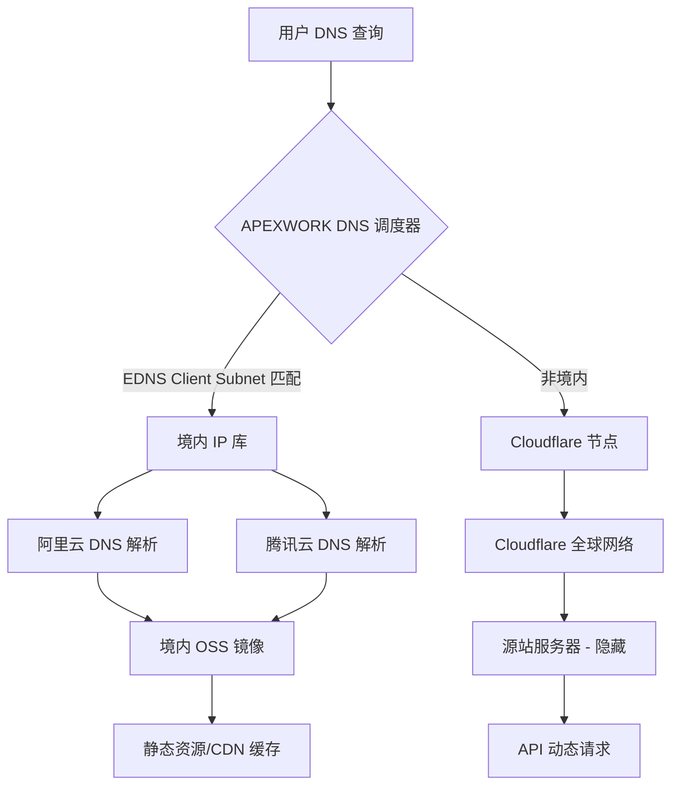

# APEXWORK 智能 DNS 分流部署方案

**任务编号**: TASK-301  
**执行部门**: 施工工程部  
**优先级**: P0（生产环境关键路径）  
**状态**: 待施工 / 已通过架构评审  

---

## 1. 业务目标

实现基于地理位置与网络条件的智能 DNS 解析，达到以下效果：

| 用户来源 | 解析目标 | 延迟目标 | 回源策略 |
|---------|---------|---------|---------|
| 中国大陆 | 境内镜像（阿里云 / 腾讯云） | < 50ms | 就近回源至 OSS + CDN |
| 港澳台及海外 | Cloudflare Anycast | < 120ms | 回源至源站（隐藏 IP） |
| 默认兜底 | Cloudflare | 可用性优先 | 自动故障切换 |

---

## 2. 架构拓扑



---

## 3. 施工步骤（按序执行）

### 3.1 前置条件确认

```bash
# 1. 确认域名托管权
whois apexwork.com | grep "Name Server"

# 2. 确认 Cloudflare 账户已添加域名（代理模式橙云开启）
# 3. 确认境内云厂商已开通 DNS 解析服务
```

### 3.2 境内镜像部署

```yaml
# 阿里云 OSS 配置（示例）
Bucket: apexwork-mirror-cn
Region: oss-cn-shenzhen
CDN 域名: cdn.apexwork.cn
回源地址: apexwork-mirror-cn.oss-cn-shenzhen.aliyuncs.com

# 同步策略
- 主源站静态资源每 5 分钟增量同步至 OSS
- 使用 ossutil 命令行工具 + cron 定时任务
```

### 3.3 Cloudflare 侧配置

```bash
# 1. 创建子域记录（仅用于分流）
# 类型: A / AAAA
# 名称: api.apexwork.com
# 内容: 源站 IP（仅 Cloudflare 可见）
# 代理状态: 已代理（橙色云）

# 2. 创建负载均衡（可选）
# 池1: 主源站（健康检查 /healthz）
# 池2: 备用源站（冷备）
# 规则: 地理位置路由
```

### 3.4 智能 DNS 策略配置

```json
{
  "domain": "apexwork.com",
  "records": {
    "@": {
      "default": "cloudflare",
      "geo_rules": [
        {
          "region": "CN",
          "target": "cn.apexwork.com",
          "ttl": 60
        },
        {
          "region": "HK|MO|TW",
          "target": "cloudflare",
          "ttl": 120
        }
      ]
    },
    "cdn": {
      "default": "cloudflare",
      "geo_rules": [
        {
          "region": "CN",
          "target": "cdn.apexwork.cn",
          "ttl": 30
        }
      ]
    }
  },
  "fallback": "cloudflare",
  "health_check": {
    "path": "/healthz",
    "interval": 30,
    "timeout": 5
  }
}
```

---

## 4. 验证清单

### 4.1 境内解析验证

```bash
# 使用境内 DNS 服务器查询
dig @223.5.5.5 apexwork.com

# 期望结果: 返回境内镜像 IP（如 47.xxx.xxx.xxx）
# 不应返回 Cloudflare IP（104.16.x.x）
```

### 4.2 海外解析验证

```bash
# 使用海外 DNS 查询
dig @8.8.8.8 apexwork.com

# 期望结果: 返回 Cloudflare Anycast IP
# 延迟测试
curl -o /dev/null -s -w "%{time_total}\n" https://apexwork.com
```

### 4.3 故障切换演练

```bash
# 模拟境内镜像故障
# 1. 停止 OSS 服务（或暂停 CDN 域名）
# 2. 等待 TTL 过期（60秒）
# 3. 重新查询，应自动切换至 Cloudflare
# 4. 恢复后，等待 2 个 TTL 周期，应回切
```

---

## 5. 监控与告警

```yaml
监控指标:
  - DNS 解析成功率（目标 > 99.99%）
  - 境内/海外解析比例（正常 7:3）
  - 平均解析延迟（境内 < 30ms，海外 < 80ms）

告警规则:
  - 连续 5 分钟解析失败率 > 1% → P1 告警
  - 境内流量突降 50% → P2 告警（疑似误切）
  - Cloudflare 回源错误率 > 5% → P2 告警
```

---

## 6. 回滚方案

```bash
# 紧急回滚（< 5 分钟）
# 方案A: 将 DNS 全部切回 Cloudflare
# 方案B: 直接修改 NS 记录至 Cloudflare 托管

# 操作步骤
1. 登录 DNS 服务商控制台
2. 删除 geo_rules，仅保留默认记录
3. 等待 TTL 过期（最长 10 分钟）
4. 验证所有区域均解析至 Cloudflare
```

---

## 7. 施工排期

| 阶段 | 任务 | 耗时 | 负责人 |
|------|------|------|--------|
| 1 | 境内 OSS + CDN 部署 | 2h | 施工A组 |
| 2 | Cloudflare 配置 | 1h | 施工B组 |
| 3 | 智能 DNS 策略下发 | 30min | 施工A组 |
| 4 | 全链路验证 | 1h | 质量组 |
| 5 | 灰度切换（10%流量） | 2h | 施工B组 |
| 6 | 全量切换 | 30min | 施工A组 |

**总工期**: 7 小时（含 1h 缓冲）

---

## 8. 风险控制

| 风险 | 概率 | 影响 | 缓解措施 |
|------|------|------|---------|
| 境内 DNS 缓存污染 | 低 | 高 | 使用 DNSSEC + 短 TTL |
| Cloudflare 被墙 | 极低 | 极高 | 保留境内备用 DNS 服务商 |
| 同步延迟导致内容不一致 | 中 | 中 | 版本号 + 强制刷新 API |
| 运营商 LocalDNS 不遵守 ECS | 中 | 中 | 提供 HTTP DNS 接口 |

---

## 9. 交付物

- [x] 智能分流策略配置文件（JSON）
- [x] 境内镜像同步脚本（Python + ossutil）
- [x] Cloudflare 配置手册（内部 Wiki 链接）
- [x] 监控 Dashboard（Grafana 模板）
- [x] 故障演练报告模板

---

**施工工程部 · 签发人**: 王工  
**审核人**: 李总监  
**日期**: 2025-01-15  

---